# Event-Driven Yaklaşımlı .Net Çözümlerinde Test Edilebilirlik

Bu repoya konu olan çalışmadaki amaç .Net ile yazılmış ve event-driven yaklaşımını benimsemiş çözümlerde uçtan uca karmaşık testlerin nasıl yapılacağını anlamaya çalışmaktır. Microservice yaklaşımını benimseyen dağıtık sistem çözümlerinde test edilebilirlik önemlidir. Sistemin parçalarının her an test edilebilir olması code coverage değerlerini yukarı çekip olası üretim hatalarının önüne geçmek için elzemdir. Repodaki çalışmada amaç öncelikle Event-Driven yaklaşıma uygun basit bir çözüm geliştirmek sonrasında test konusunu ele almaktır.

## Senaryolar

Çözüm içerisinde iki servis yer alıyor. EmployeeService ve InsuranceService. Her ikisi de basit birer REST servisi ve kendi SQLite veritabanlarına sahipler. InsuranceService içerisinde yer alan controller sınıfı, kontrat oluşturmak, güncellemek ve listelemek için üç fonksiyon içeriyor. EmployeeService içerisinde yer alan controller'da çalışan için satacağı poliçe sayısını hazırlamak, çalışan ve kontratları listelemek için üç fonksiyon içermekte. Yeni bir kontrat oluşturulması veya güncellenmesi EmployeeService için bir event anlamı taşımakta ve bu değişiklikler EmployeeService tarafından da değerlendirilmekte. Benzer durum sistemdeki bir sigortacı(çalışan) satışa çıkarken kullanacağı poliçileri sepetine aldığı zaman da geçerli. Bu durumda InsuranceService bundan haberdar olabilmeli ve kontrat miktarları buna göre revize edilmeli. 

Servislerde gerçekleşen bazı eylemler sistem için bir olay(event) anlamına gelmekte. Bu noktada bir olayın muhatabının bu olayla ilgilenmesi için bir sisteme ihtiyaç var. RabbitMQ burada devreye giriyor. Servisler olaylarını asenkron olarak RabittMQ kuyruğuna bırakabiliyorlar. Olayın muhatapları bu aktiviteleri dinleyip kendi tarafları için gerekli eylemleri yapabiliyorlar. Bir servis tarafından üretilen bir nesnenin diğer servis tarafından da anlaşılabilmesi için ideal bir yapı. Dağıtık sistemlerde çok kullanılan bir çözüm.

## RabbitMQ Hazırlıkları

RabbitMQ'yu sistemde kolayca ayağa kaldırmak için DockerCompose dosyasından yararlanılabilir.

```shell
sudo docker-compose up
```

RabbitMQ sistemde ayağa kalktıktan sonra varsayılan olarak http://localhost:15672/#/ adresinden ulaşılabilir. Çözümde servisler arası haberleşmede bir exchange topic ve ayrılmış mesaj kuyrukları söz konusu.

Oluşturulan sales.exchange isimli exchange nesnesinin özellikleri şöyle olmalı.

```text
Name : sales.exchange
Type : topic
Durable : true,
AutoDelete : false,
Internal : false,
Arguments : null
```

Bu exchange ile ilişkili olan kuyruklar ise aşağıdaki gibi oluşturulmalı.

```text
Name : insurance.employee
Type : classic
VHost: /
AutoDelete : false
Durable : true

Name : insurance.contract
Type : classic
VHost: /
AutoDelete : false
Durable : true
```

Oluşturulan bu mesaj kuyruklarının ilgili exchange'e bağlanması da gerekir. Aşağıdaki ekran görüntüleri setup konusunda fikir verebilir.

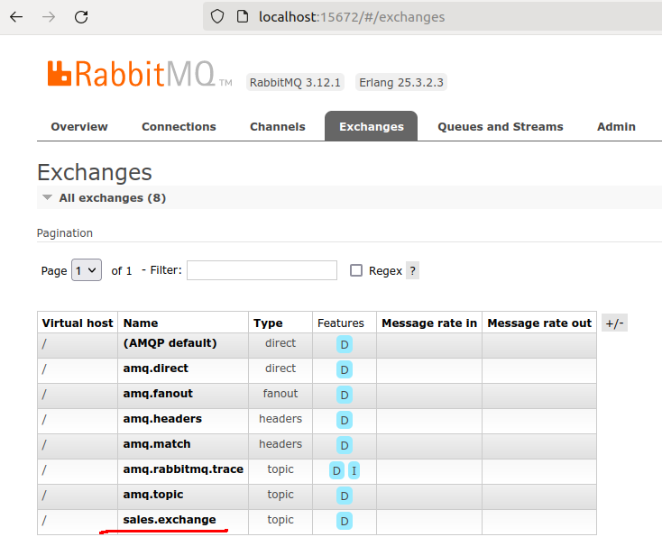

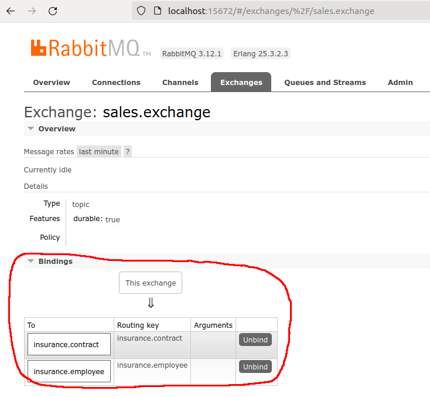

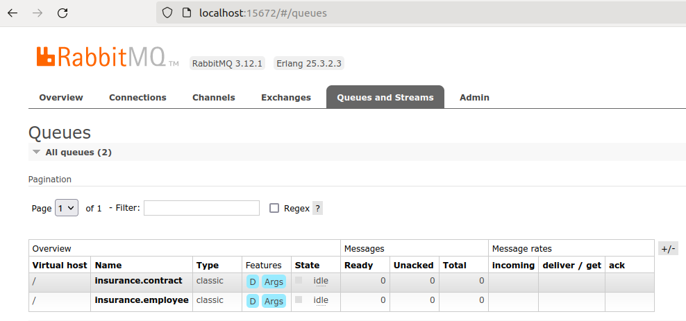

### RabbitMQ Çalışırlığının Kontrolü

Eğer işler yolunda gittiyse örnek bir Contract oluşturma talebine karşılık RabbitMQ tarafındaki ilgili mesaj kuyruğunda bir hareket olması gerekir.

Örneğin InsuranceService ayağa kaldırıldıktan sonra yeni bir sigorta sözleşme tipini sisteme eklemek istediğimizde aşağıdaki gibi bir talep kullanabiliriz.

```bash
curl -X 'POST' \
  'http://localhost:5011/Contract' \
  -H 'accept: text/plain' \
  -H 'Content-Type: application/json' \
  -d '{
  "contractId": "3fa85f64-5717-4562-b3fc-2c963f66afa6",
  "title": "Bireyse Sağlık Sigortası Tip A",
  "quantity": 10
}'
```

Buna karşın RabbitMQ tarafında şöyle bir şeyler görebiliyor olmamız gerekir.

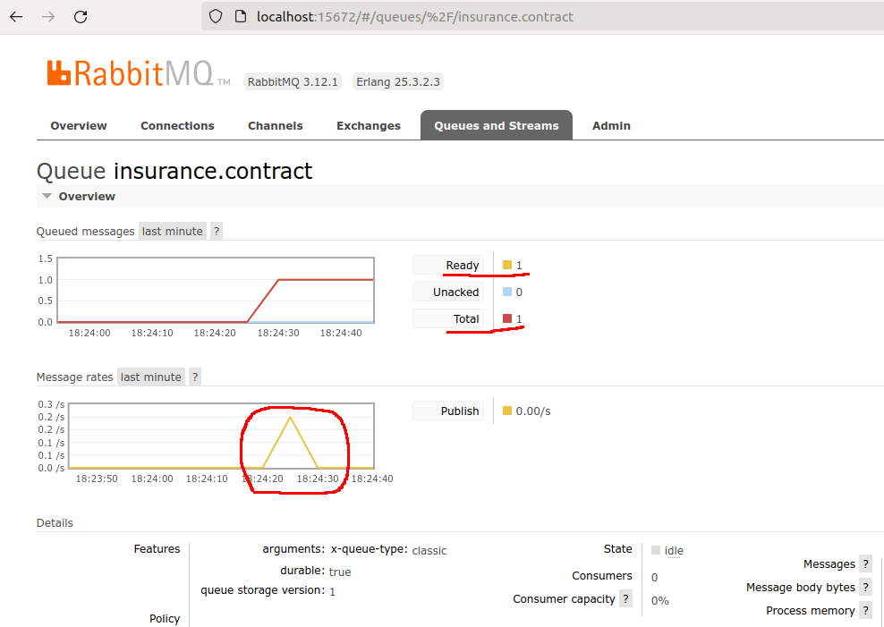

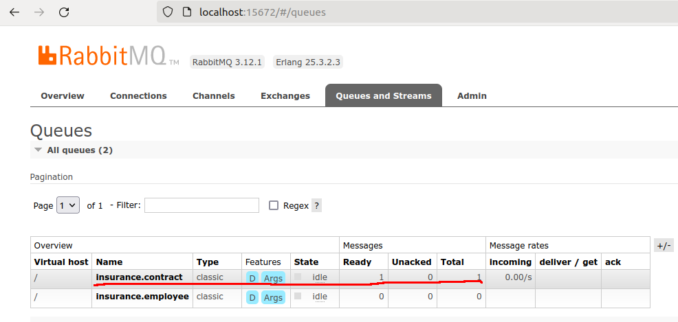

## İlk Gün Testi

InsuranceService'teki CreateContract servis çağrımı ile yeni bir poliçe sisteme girildiğinde RabbitMQ tarafındaki insurance.contract kuyruğuna yeni eklenen veri bilgisini içeren bir mesaj bırakılır. EmployeeService ayaktaysa eğer, background task olarak çalışan servis insurance.contract kuyruğuna gelen mesajı yakalar. Mesaj içeriğinde gelen JSON tabanlı Contract içeriğini değerlendirir. ContractId bilgisini kullanarak kendi veritabanında _(EmployeeService.db)_ böyle bir poliçe olup olmadığına bakar. Eğer varsa kendi veritabanındaki poliçe bilgilerini günceller, yoksa yeni bir poliçe olarak ekler.

Bu ilk çalışma zamanı testini gerçekleştirmek için EmployeeService ve InsuranceService uygulamaları ayrı ayrı başlatılır. RabbitMQ arabirimine de http://localhost:15672 adresinden erişilir olduğundan emin olmak gerekir. İlk gün denemesinde insurance.contract isimli kuyruğa akan mesajlar yakalanır. Örneğin aşağıdaki ekran görüntüsünde olduğu gibi InsuranceService üstünden yeni bir Contract oluşturulduğunda, EmployeeService uygulaması buna ilişkin üretilen olayı dinlediği mesaj kuyruğundan yakalar, gerekli EF komutlarını işletir.

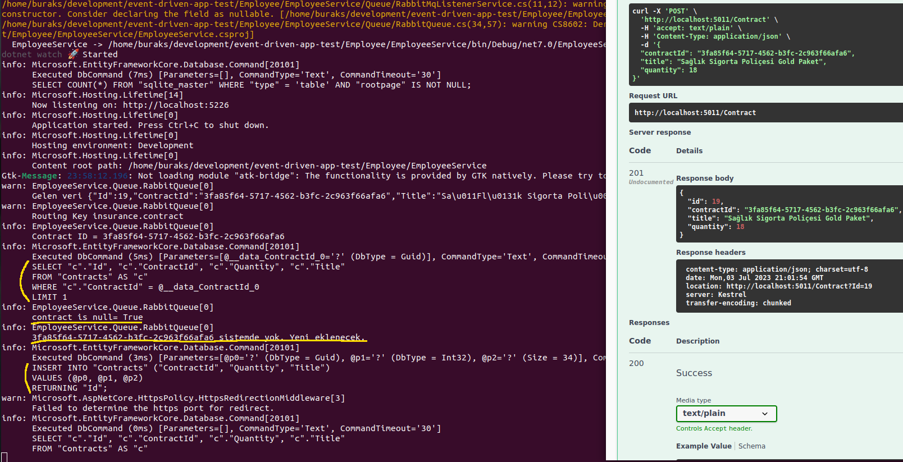

ve hatta bu otomatik gerçekleşen dinleme işlemi sonrası EmployeeService üstünden poliçe bilgileri istendiğinde aşağıdaki gibi yeni gelen poliçenin kendi veritabanına eklendiği gözlemlenir.

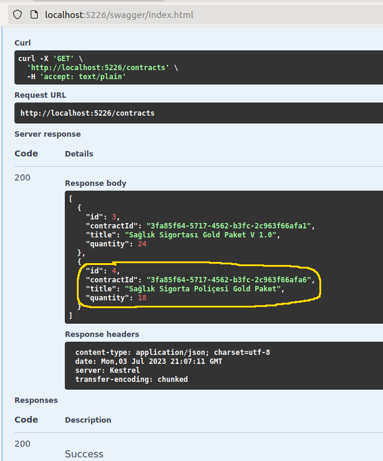

## İkinci Gün Testi

EmployeeService'indeki Post fonksiyonunu kullanarak var olan bir poliçenin miktarını değiştirdiğimizde buna bağlı olarak Insurance tarafındaki sözleşmenin de miktarı değiştirilir. Yani EmployeeService bir olay ile InsuranceService'i uyarırken tam tersi yönde bir mesaj yayını da söz konusudur. Örneğin EmployeeService üzerinden aşağıdaki gibi bir çağrım gerçekleştirdiğimizde,

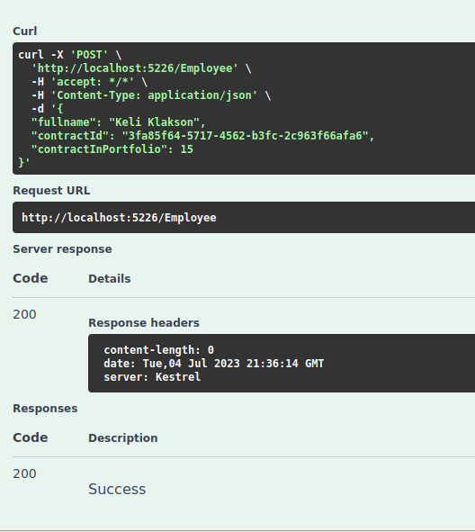

InsuranceService tarafında aşağıdaki hareketler gerçekleşir.

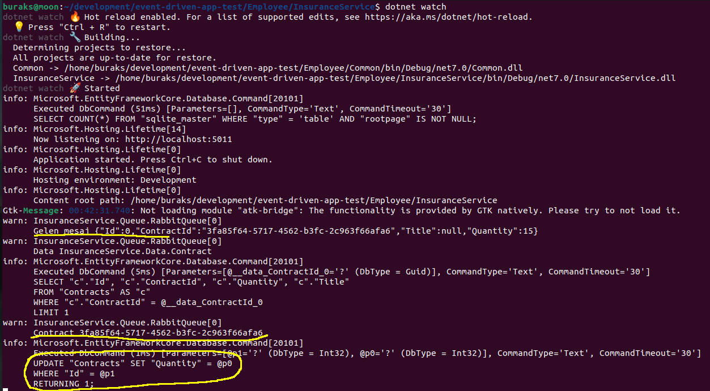

Yani InsuranceService kendi tarafındaki ilgili Contract verisinin Quantity değerini günceller. Nitekim EmployeeService, bir çalışanını ilgili poliçe'den belli miktarda sattığına/aldığına dair bir olay bildirimi yapmıştır. EmployeeService tarafında ise aşağıdaki gibi bir çalışma zamanı gerçekleşir.

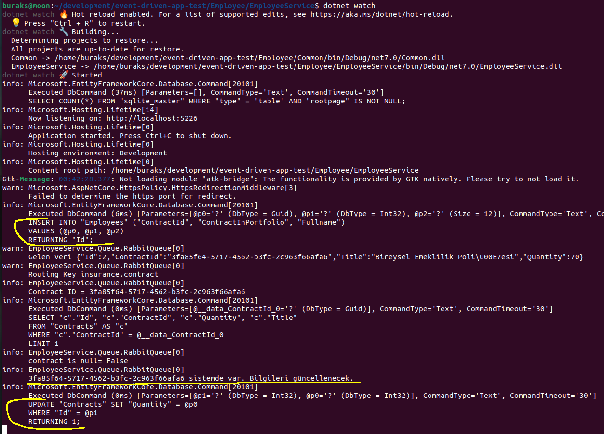

Buna göre InsuranceService'te kendi tarafını güncelledikten sonra tekrar bu sözleşme bilgisine istinaden bir güncelleme olduğunu duyurur. Bu olay EmployeeService tarafından dinlendiği için EmployeeService kendi tarafındaki Contract tablosunda güncellemeye gider.

## Web App Tarafı için Proxy Sınıflarının Üretilmesi

Eğitimde önyüz tarafındaki uygulamalar birer MVC projesi şeklinde oluşturulmakta. MVC projelerindeki Controller sınıflarının otomatik üretimi için Swagger şemasından yararlanabilen NSwag isimli CLI aracı kullanılmakta. Öncelikle bu aracın sistem yüklenmesi gerekiyor.

```bash
dotnet tool install --global NSwag.ConsoleCore

# sonrasında InsuranceService çalıştırılıp swagger dokümanı json formatında çekilmelidir
# Bu çalışma için örneğin http://localhost:5011/swagger/v1/swagger.json adresindeki içerik alınıp
# Insurance.WebApp projesindeki ApiProxy klasörüne kaydedilir.
# Sonrasında aşağıdaki komutlarla proxy sınıfının üretilmesi sağlanır. (Komut ApiProxy altında işletilmiştir)
nswag openapi2csclient /input:swagger.json /classname:InsuranceApiClient /namespace:Insurance.WebApp /output:InsuranceApiClient.cs
```

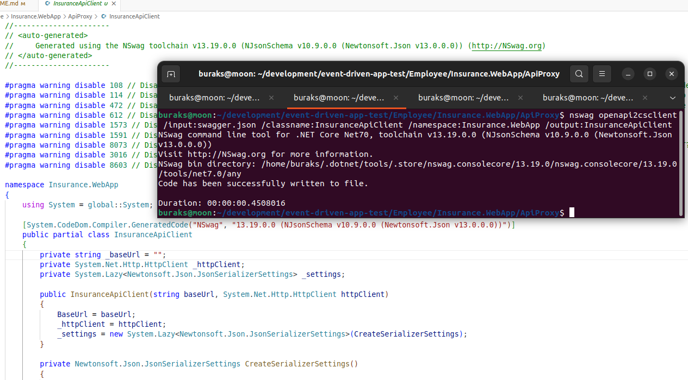

Burada yapılanları bir nevi Add Web Reference veya Add Service Reference işlemlerine benzetebiliriz. Insurance.WebApp projesindeki ApiProxy klasöründe otomatik olarak üretilen proxy sınıfı haricinde bunun kullanımını kolaylaştırmak üzere soyutlayan ve DI mekanizmasına kolayca monte edilmesini sağlayan yardımcı bir sınıfta vardır. IInsurancaApiHandler arayüzünü implemente eden InsuranceApiHandler sınıfı.

İkinci web uygulaması ise çalışanların satış için kullandığı portföy bilgilerini yöneten bir program olarak tasarlanmaktadır. Temelde bir çalışan, satışa çıkmadan önce portföyüne belli miktarda poliçe alır. Bu işlerin görsel olarak yapıldığı uygulama olarak düşünebiliriz. Tabii bir önceki web uygulaması için geçerli olan işlemler bu uygulama içinde benzerdir. Employee.WebApp olarak isimlendireceğimiz mvc uygulaması da EmployeeService isimli api hizmetinin swagger üretimli proxy sınıfını kullanmaktadır. Dolayısıyla Insurance.WebApp uygulamasında olduğu gibi nswag aracı kullanılarak bu proxy sınıfının üretilmesi sağlanır.

Not: ApiHandler görevi üstlenen enstrümanlar ve proxy sınıfları sonradan Common projesi altına alınmıştır. Güncel proxy sınıfı üretimleri için bu projedeki ApiClient/Employee ve ApiClient/Insurance klasörlerinde sırasıyla aşağıdaki komutlar işletilmiştir.

```bash
nswag openapi2csclient /input:swagger.json /classname:EmployeeApiClient /namespace:Common.ApiClient.Employee /output:EmployeeApiClient.cs

nswag openapi2csclient /input:swagger.json /classname:InsuranceApiClient /namespace:Common.ApiClient.Insurance /output:InsuranceApiClient.cs
```

## Üçüncü Gün Testi

Şu anda Insurance ve Employee tarafları için servis ve UI projeleri hazır durumda. UI üstünden poliçe girişi yapıp, bunu personele kullandırtabilir ve her iki uygulama tarafındaki verilerin nasıl değiştiğini inceleyebiliriz.


## Dördüncü Gün (Houston We Have a Problem)

Dördüncü gün testlerinde ubuntu sistemimde bir sorun yaşıyorum. Dockerize edilip docker-compose ile ayağa kaldırılan api servisleri aynı ağda olmalarına rağmen rabbitmq tarafına mesaj gönderemiyorlar. Yıldız tarihi 2023 itibariyle olayların gelişimi şöyle.

Api ve WebApp'lar için birer dockerfile oluşturuldu. Bunlar docker-compose.yml dosyasında birleştirildi. RabbitMQ imajı da buraya alındı. Tüm servisler için bridge tipinden bir network tanımlandı. Ardından aşağıdaki komutlarla çalışmaya devam edildi.

```bash
# build işlemleri için
sudo docker-compose build

# docker container'larını ayağa kaldırmak içinse
sudo docker-compose up
```

Standart olarak servis ve web adreslerine erişilebildiği görüldü. Ancak docker-compose loglarında şu hata mesajı ile karşılaştım.
**Unhandled exception. RabbitMQ.Client.Exceptions.BrokerUnreachableException: None of the specified endpoints were reachable**

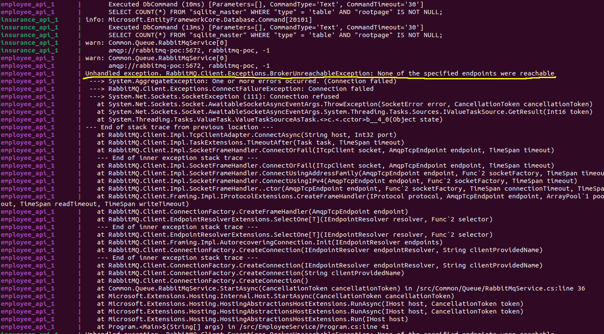

Bunun üzerine appsettings dosya içeriklerini kontrol ettim. localhost yerine docker-compose dosyasında belirtilen rabbitmq-poc adını kullanmam gerektiğini biliyordum. Ancak yine de servisler rabbitmq sunucusuna erişememekteler. Aklıma network durumunu kontrol etmek geldi. Api servisleri, web uygulamaları ve rabbitmq aynı ağ içerisinde olmalıydılar. Aşağıdaki komutlarla devam ettim.

```bash
# önce network listesini taradım
sudo docker network ls

# sonra employee_mordor olarak oluşturulmuş ağı inceledim
sudo docker network inspect 3ad
```

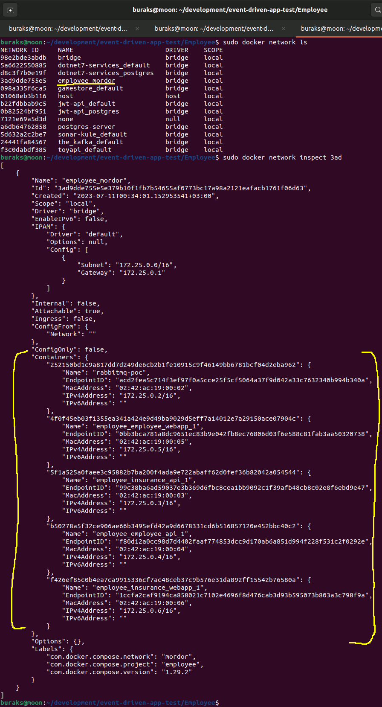

Aslında tüm servisler aynı ağa bağlanmış görünüyordu. Yine de servislerden rabbitmq tarafına mesaj gönderememekteyim. Bunu üzerine container'ların içerisine girip appsettings dosyalarını elle değiştirmeye ve network için atanan ip adresini kullanmaya karar verdim. Hatta insuranceapi ve employeeapi container'larından terminal açıp bu ip adreslerine telnet çekmeyi bile denedim.

```bash
# Tabii öncesinde container'ları bulmak lazım
sudo docker ps -a

# Örneğin insuranceapi isimli container içerisine bir terminal açmak için
# şu komut kullanılabilir.
sudo docker exec -it 5f1 bash

# Tabii dosyaları düzenlemek için en azından nano gerekiyor.
# Kullanılan imajlarda bu program hazır gelmediğinden install etmek gerekiyor.
apt-get update
apt-get install nano

# Sonrasında ip bilgilerini rabbitmq'ya göre güncelledim.
```

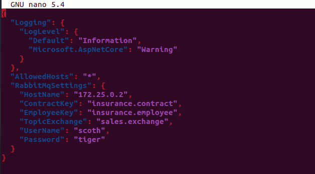

Ancak sonuç değişmedi. Birkaç kez docker-compose içeriğini kaldırıp _(sudo docker-compose down)_ tekrardan ayağa kaldırsam da iletişim kurulmasını başaramadım. Sorunu henüz çözebilmiş değilim ancak eğitimin diğer modüllerine devam ediyorum. Eğitim asıl konusu olan test kısımlarında dockersız ilerleyebilirim. Diğer yandan hatayı çözemesemde birçok şey öğrendim. Docker-compose'da servisleri bir araya getirme, aynı ağa bağlama, ağın bilgilerini öğrenme, container içerisine terminal açma, terminalde nano ile dosya değiştirme vs 

~~Hiç yoktan iyidir.~~

### Sorun Çözüldü

Büyük ihtimalle o gece bu konu üzerine çok uğraştığım için hatayı gözden kaçırdım. Sorun RabbitMQ tarafındaki Exchange Topic ayarlaması ile ilgiliydi. Meğerse To kısmını yazmışken Routing Key kısımlarını boş bırakmışım.

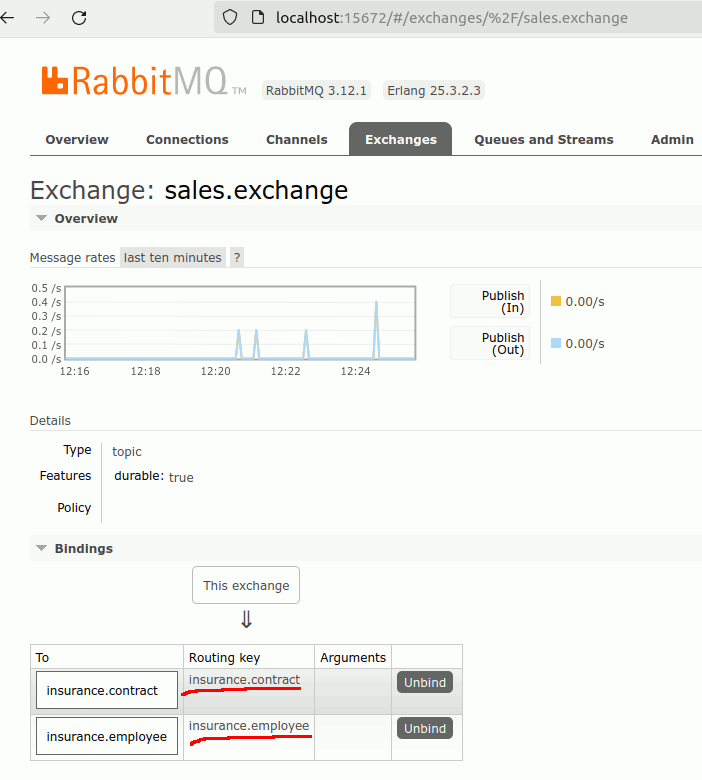

Burayı doğru şekilde tanımladıktan sonra kuyrukların çalışmaya başladığını ve uygulamalar arası olayların tetiklenebildiğini gördüm.

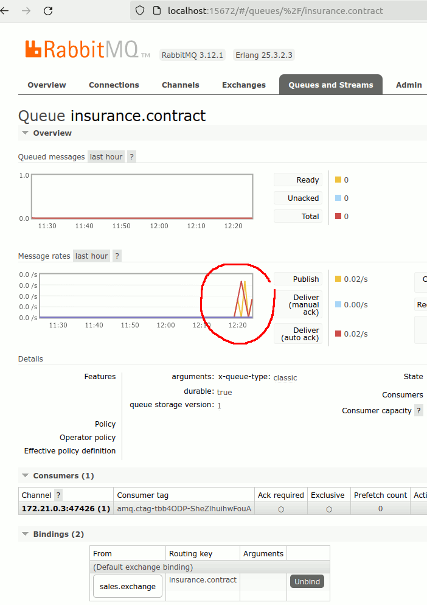

## Kullanıcı Arayüz Testleri (UI Tests)

UI Testleri için oluşturulan xunit tabanlı projeye [Playwright for .Net](https://playwright.dev/dotnet/) aracı eklenmiştir. Playwright ile web otomasyon testlerini yazmak mümkündür. Yani bir unit test fonksiyonundan tarayıcı açtırmak, belli bir adrese gitmek, alanları doldurmak, submit işlemlerini gerçekleştirmek, DOM nesne içeriklerini kontrol etmek vesaire gibi. Dolayısıyla örneğin Insurance.WebApp ya da Employee.WebApp projelerindeki UI testleri için manuel hareket etmek yerine kabul kriterlerini otomatize ettirebiliriz.

```bash
# Tabii sistemde Playwright'ın yüklü olması gerekiyor.
npx playwright install

# xUnit tabanlı test projesini oluşturuyoruz
dotnet new xunit -o Employee.Test.UI

# Playwright paketini ekliyoruz
dotnet add package Microsoft.Playwright

# Ayrıca test kabul kriterleri için FluentAssertions paketi kullanılmaktadır
dotnet add package FluentAssertions

# Testleri koşmak içinse
dotnet test
```

Örnekte yazılan ilk test metodu Insurance.WebApp uygulaması açıp Poliçe Oluştur sayfasına geliyor ve örnek bir poliçe bilgisi oluşturup submit ediyor. 

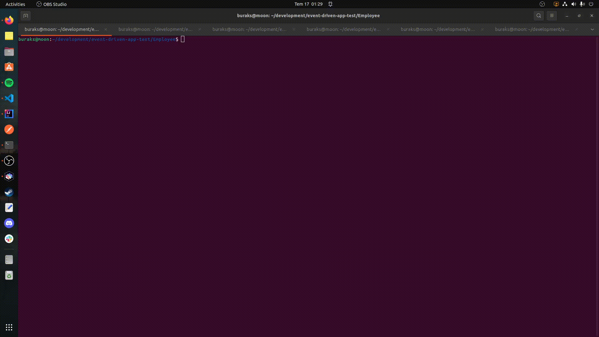


**EĞİTİMİM DEVAM EDİYOR. KONULARI İŞLEDİKÇE EKLEYECEĞİM.**
